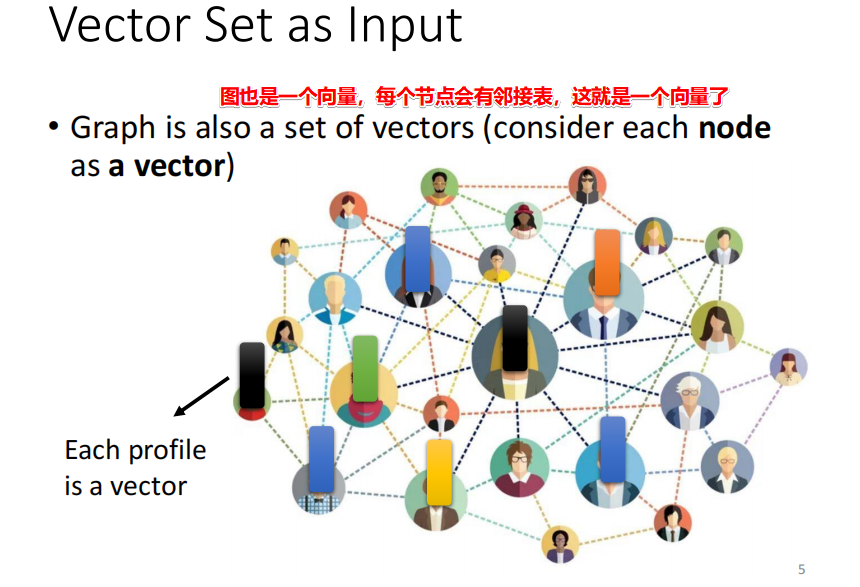
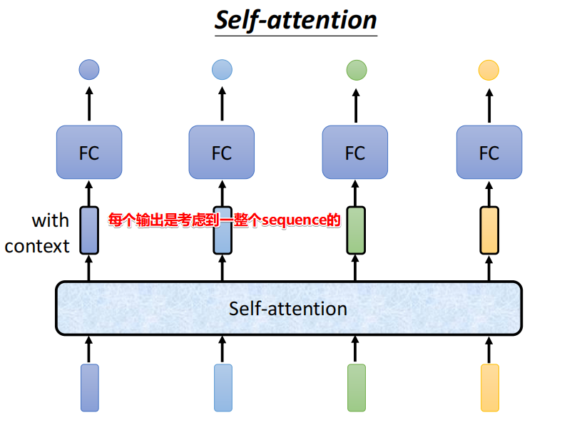

# 输入

前面讲了CNN，现在来讲一下十分重要的另外一个network——自注意力机制。

首先是输入的不同：

那有哪些是这样的情况呢，就是向量的长度每次不同，大小相同。

1、输入是一个句子

2、声音信号的输入

3、图也是一个向量

# 输出

1、第一种输入输出长度一致：每个向量都有一个输出

2、整个输入只有一个输出

3、输出的长度不定

# 第一种任务

每个向量都有一个label，这个任务也叫做 **Sequence Labeling**

这是有可能的，比如说：我们把前后几个向量串起来丢到FC里面，也就是相邻的向量。

但这个还是有局限性，毕竟这只是一个窗口，那如何去考虑整个句子呢

这就要开始讲到我们的自注意力机制了，它可以做到！！

并且呢，这个Self-attention层，可以进行叠加的，最著名的利用该机制的文章就是我们说的transformer了。

# self-attention原理

考虑到了每个向量

那如何找到我们需要的b1向量呢？

1、首先找出每个和a1相关的向量，因为我们希望即考虑整个句子向量，但又不希望将所有的句子向量信息都包含进去，那么我们要找出哪些部分是和a1更重要的，哪些是不重要的。

2、如何计算相关系数。

3、将这个机制用到前面的self-attention层里面：

加上和a1自身的相关性：这个非常重要！！！不做的会非常影响。

最后呢，会再通过一个softmax，那为什么要用这个？能不能不用，或者用其他的Relu。其实没有什么道理，这里也可以用Relu。

最后就是利用注意力分数来抽取信息得到b1。

还有一点：并行性！！！

再看一下如何得到b2。原理是一样的。

**用矩阵乘法的角度来看一下上诉过程**

1、首先是对于单个的q1计算。就是乘以一个Wq矩阵。

2、那么其他的几个q2、q3等也是这个操作哈，而且这个矩阵是共享权重的，也就是每个q都是乘以同一个矩阵等到的。我们把它拼起来。这就是并行计算了！！

3、接下来，我们看一下注意力分数的计算。

最后，我们也可以把四个拼起来，看成是矩阵和向量相乘。将四个k在行维度拼起来，变成一个矩阵去乘q1，就到了一个四行的向量（4x1）。

这就是第一个，a1的注意力score的计算过程了，那么a2也是同理对不对，a2的q2也是乘以4个k向量，所以是不是我们可以直接拼起来呢，如下，就得到了一个4x4的score矩阵。

> 最后的归一化方式也可以用其他的，例如relu。

4、最后我们看一下b1、b2的计算方式。

​		注意力分数 x 信息矩阵value。

最后，我们进行一下总结，使用矩阵的方式看：看起来很复杂，但其实只有三个矩阵参数需要学习

# 多头注意力机制

那我们常说的多头注意力机制又是什么意思呢？

其实就是说，不同的词之间会有不止一种的关联性。例如两个人可能外貌相似，性格相似，身高不相似......每个头呢就是负责不同的相关性。

这里在自注意力机制的基础上，就是多了几个Wq、Wk、Wv矩阵而言。拿2个头举例：

然后，我们看一下如何去计算呢？其实在计算每个头的时候，是相互不关联的，你计算你的，我计算我的，最后就会出现多个输出的b1了，例如两个头时，对于a1的输出b1就会有b11，b12两个。

然后呢，对于这两个b1如何处理呢，其实可以想到最常见的就是把他们两个拼起来，然后乘以一个矩阵，最后得到一个最终的向量b1了。

# 位置资讯

上面那些东西看起来很厉害，但是少了一个特别重要的东西——位置信息！！！无法知道每个input是出现在句子的最前面，还是最后面。因为位置的信息是很重要的，例如动词一般不会放在句首。

所以我们这里要有一个位置编码——positional encoding。

那么这个ei如何定义呢？最初的ei是这样定义的，就是transformer那篇文章。

人设置的就存在一些问题，因为句子长度撒，之前是通过sin、cos来解决的。

对于这个codeing方式并不是一个顶解，可以有多种不同的定义，例如你可以看一下下面这篇论文，有多种不同的方式产生。也可以通过网络learn出来。

目前还不知道哪一种方式最好了。

